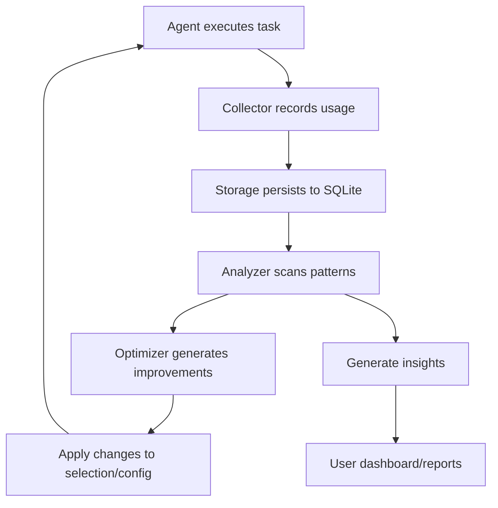
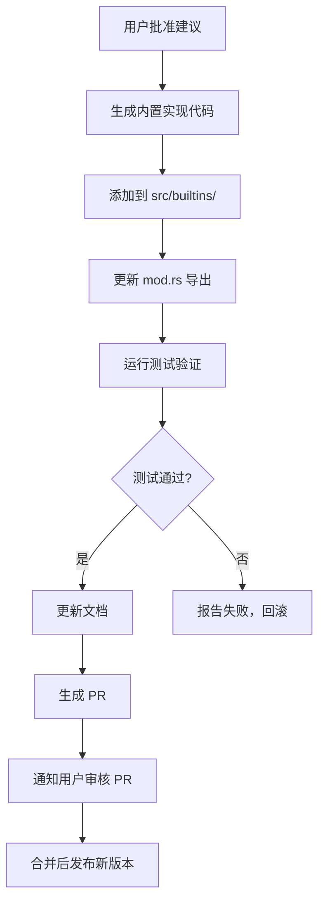

# ClawHub Integration Design

**Date:** 2026-02-21
**Status:** Design Phase
**Author:** ZeroClaw Team

## Overview

设计一个通用的 Claw 生态系统技能互操作层，支持 ZeroClaw 使用来自 OpenClaw、NanoBot、PicoClaw、NullClaw 等所有 Claw 项目的 700+ 技能。

## Requirements

### Functional Requirements
1. ✅ 支持从 ClawHub.ai 安装技能
2. ✅ 支持从 GitHub 仓库安装技能
3. ✅ 支持本地路径安装技能
4. ✅ 自动检测和转换不同 Claw 项目的技能格式
5. ✅ 热加载机制 - 安装后立即可用，无需重启
6. ✅ 搜索和浏览 ClawHub 技能索引
7. ✅ 显示热门和趋势技能
8. ✅ 技能验证和依赖检查

### Non-Functional Requirements
1. ✅ 向后兼容现有 ZeroClaw 技能
2. ✅ 最小化内存和性能开销
3. ✅ 安全的文件操作（防止路径遍历）
4. ✅ 离线模式支持（本地缓存）
5. ✅ 清晰的错误消息和日志
6. ✅ 完整的测试覆盖

## Architecture

### Module Structure

```
src/clawhub/
├── mod.rs              # 模块入口和导出
├── types.rs            # 通用数据结构
├── sif.rs              # 技能中间格式 (Skill Intermediate Format)
├── registry.rs         # ClawHub API 客户端
├── cache.rs            # 本地缓存管理
├── converter.rs        # 各格式 → SIF 转换器
├── hotload.rs          # 热加载机制
├── error.rs            # 错误类型定义
├── detectors/          # 自动检测器
│   ├── mod.rs
│   ├── openclaw.rs
│   ├── nanobot.rs
│   ├── picoclaw.rs
│   ├── nullclaw.rs
│   └── zeroclaw.rs
└── tests/              # 集成测试
    ├── mod.rs
    ├── sif_tests.rs
    ├── detector_tests.rs
    ├── hotload_tests.rs
    └── integration_tests.rs
```

### Data Flow

```
┌─────────────────┐
│  User Command   │
│  (CLI / Agent)  │
└────────┬────────┘
         │
         ▼
┌─────────────────────────────┐
│   ClawHubClient             │
│   - Search skills           │
│   - Get trending            │
│   - Download skill package  │
└────────┬────────────────────┘
         │
         ▼
┌─────────────────────────────┐
│   DetectorRegistry          │
│   - Detect skill format     │
│   - Parse to SIF            │
└────────┬────────────────────┘
         │
         ▼
┌─────────────────────────────┐
│   SkillSIF (Intermediate)   │
│   - Universal format        │
│   - Language agnostic       │
└────────┬────────────────────┘
         │
         ▼
┌─────────────────────────────┐
│   ZeroClaw Converter        │
│   - SIF → SKILL.toml        │
│   - Save to workspace       │
└────────┬────────────────────┘
         │
         ▼
┌─────────────────────────────┐
│   SkillHotLoader            │
│   - File watcher            │
│   - In-memory update        │
│   - Event notification      │
└────────┬────────────────────┘
         │
         ▼
┌─────────────────────────────┐
│   Agent Prompt              │
│   - Skills active           │
│   - Hot-loaded instantly    │
└─────────────────────────────┘
```

## Key Components

### 1. Skill Intermediate Format (SIF)

A language-agnostic skill representation that all Claw project formats can be converted to/from.

**Key Features:**
- Unified metadata structure
- Platform-specific tool implementations
- Flexible content format (Markdown, Steps, Mixed)
- Dependency tracking
- Source project tagging

### 2. Detector Registry

Auto-detects which Claw project a skill belongs to and parses it accordingly.

**Supported Detectors:**
- `OpenClawDetector` - TypeScript/YAML frontmatter
- `NanoBotDetector` - Python/dict-based
- `PicoClawDetector` - Go/YAML
- `NullClawDetector` - Zig/JSON
- `ZeroClawDetector` - Rust/TOML

### 3. Skill Hot Loader

Monitors skills directory for changes and updates in-memory skill cache without restart.

**Features:**
- File system watcher (using `notify` crate)
- Debounced event handling (300ms default)
- Version tracking for updates
- Event notification system
- Thread-safe access via `RwLock`

### 4. ClawHub Client

Interacts with ClawHub API for skill discovery and download.

**Features:**
- Local index caching (24-hour TTL)
- Search by name, description, tags
- Trending skills by downloads
- Direct GitHub integration
- Offline mode support

## Configuration

```toml
[clawhub]
enabled = true
index_update_interval_hours = 24

[clawhub.hotload]
enabled = true
debounce_ms = 300
show_notifications = true

[clawhub.discovery]
sources = ["clawhub", "github", "local"]
github_whitelist = ["clawhub/*", "steipete/*"]

[clawhub.cache]
dir = "~/.cache/zeroclaw/clawhub"
index_ttl_hours = 24
package_ttl_days = 7

[clawhub.conversion]
auto_convert = true
keep_original = true
on_conversion_error = "warn"
```

## CLI Commands

```bash
# Search skills
zeroclaw skills search <query>

# Show trending
zeroclaw skills trending --count 10

# Install from ClawHub
zeroclaw skills install clawhub://weather

# Install from GitHub
zeroclaw skills install https://github.com/user/repo

# Install from local path
zeroclaw skills install ~/path/to/skill

# List installed
zeroclaw skills list

# Show skill info
zeroclaw skills info <name>

# Validate skills
zeroclaw skills validate

# Update index
zeroclaw skills update

# Remove skill
zeroclaw skills remove <name>
```

## Error Handling

### Error Types

1. **SkillNotFound** - Requested skill doesn't exist
2. **InvalidFormat** - Skill file format is invalid
3. **ConversionError** - Failed to convert between formats
4. **DependencyMissing** - Required dependency not available
5. **NetworkError** - API/network request failed
6. **IoError** - File system operation failed

### Load Results

- **Success** - Skill loaded with optional warnings
- **PartialSuccess** - Some tools/features loaded, others failed
- **Failed** - Complete failure with error details

## Security Considerations

1. **Path Validation**
   - Reject paths with `..` traversal
   - Verify canonical path stays within allowed directories
   - Use `canonicalize()` for all path checks

2. **GitHub Whitelist**
   - Only allow whitelisted repositories
   - Support wildcard patterns
   - Configurable in `[clawhub.discovery]`

3. **Command Execution**
   - Only execute whitelisted commands
   - Validate tool implementations
   - Sandbox when possible

4. **Network Security**
   - HTTPS only for ClawHub API
   - Validate SSL certificates
   - Timeout for all requests

## Testing Strategy

### Unit Tests
- SIF serialization/deserialization
- Individual detector behavior
- Converter logic

### Integration Tests
- Full install workflow
- Hot reload mechanism
- Search and trending

### Property-Based Tests
- Round-trip conversions (Original → SIF → Original)
- Skill format invariants

## Performance Considerations

1. **Lazy Loading**
   - Load skills on-demand
   - Cache parsed SIF in memory
   - Reload only on file change

2. **Async Operations**
   - Non-blocking API calls
   - Parallel skill loading
   - Background cache refresh

3. **Memory Management**
   - Limit number of cached skills
   - LRU eviction for old entries
   - Estimated overhead: <1MB for 100 skills

## Future Enhancements

1. **Skill Versioning**
   - Semantic version support
   - Upgrade/downgrade capabilities
   - Conflict resolution

2. **Skill Dependencies**
   - Automatic dependency resolution
   - Shared dependency cache
   - Dependency graph visualization

3. **Skill Marketplace**
   - User-submitted skills
   - Rating and review system
   - Skill analytics

4. **Skill Builder**
   - Interactive skill creator
   - Template library
   - Preview and test mode

## Migration Path

1. **Phase 1:** Core infrastructure (SIF, detectors, hotloader)
2. **Phase 2:** ClawHub client and CLI integration
3. **Phase 3:** Converter implementations
4. **Phase 4:** Testing and documentation
5. **Phase 5:** Community skill validation

## Rollback Plan

If issues arise:
1. Disable ClawHub integration: `[clawhub.enabled = false]`
2. Remove `src/clawhub/` module
3. Revert CLI changes
4. Keep existing `skills/` module untouched

## Success Metrics

1. ✅ Install 50+ skills from ClawHub without errors
2. ✅ Hot-load works within 1 second of file change
3. ✅ Search returns results in <100ms (cached)
4. ✅ Zero regression in existing skill functionality
5. ✅ Memory overhead <5MB for 100 skills

## Telemetry and Self-Improvement System

### Overview

ZeroClaw 会自动收集技能、工具、MCP 的使用统计数据，通过分析这些数据自动优化选择策略、提示构造和能力配置，实现自主进化和性能提升。

### Module Structure

```
src/telemetry/
├── mod.rs              # 模块入口
├── collector.rs        # 使用数据收集器
├── storage.rs          # 持久化存储 (SQLite)
├── query.rs            # 统计查询接口
├── analyzer.rs         # 数据分析和洞察
├── optimizer.rs        # 自动优化引擎
└── reports.rs          # 报告生成
```

### Data Collection

#### Tracked Metrics

**Skill Usage Metrics:**
```rust
pub struct SkillUsageEvent {
    pub skill_name: String,
    pub task_complexity: f32,          // 0.0 - 1.0
    pub task_type: String,              // "code", "analysis", "debug", etc.
    pub success: bool,
    pub execution_time_ms: u64,
    pub tokens_used: u32,
    pub user_satisfaction: Option<f32>, // 用户反馈 0.0 - 1.0
    pub selected_by: String,            // "user", "agent", "auto"
    pub context_fingerprint: String,    // 任务上下文哈希
    pub timestamp: DateTime<Utc>,
}
```

**Tool Usage Metrics:**
```rust
pub struct ToolUsageEvent {
    pub tool_name: String,
    pub skill_context: Option<String>,   // 关联的技能
    pub parameters_hash: String,         // 参数模式
    pub success: bool,
    pub error_type: Option<String>,
    pub execution_time_ms: u64,
    pub retry_count: u8,
    pub timestamp: DateTime<Utc>,
}
```

**MCP Usage Metrics:**
```rust
pub struct McpUsageEvent {
    pub mcp_name: String,
    pub resource_type: String,           // "tool", "resource", "prompt"
    pub operation: String,
    pub success: bool,
    pub data_size_bytes: u64,
    pub cache_hit: bool,
    pub timestamp: DateTime<Utc>,
}
```

**Agent Decision Metrics:**
```rust
pub struct AgentDecisionEvent {
    pub decision_type: String,           // "skill_selection", "tool_choice", etc.
    pub options_considered: Vec<String>,
    pub selected_option: String,
    pub confidence_score: f32,
    pub reasoning_trace: String,
    pub outcome: String,                 // "success", "partial", "failure"
    pub timestamp: DateTime<Utc>,
}
```

### Storage Architecture

**SQLite Schema:**
```sql
-- 技能使用记录
CREATE TABLE skill_usage (
    id INTEGER PRIMARY KEY AUTOINCREMENT,
    skill_name TEXT NOT NULL,
    task_complexity REAL,
    task_type TEXT,
    success BOOLEAN,
    execution_time_ms INTEGER,
    tokens_used INTEGER,
    user_satisfaction REAL,
    selected_by TEXT,
    context_fingerprint TEXT,
    timestamp DATETIME DEFAULT CURRENT_TIMESTAMP
);

CREATE INDEX idx_skill_name ON skill_usage(skill_name);
CREATE INDEX idx_task_type ON skill_usage(task_type);
CREATE INDEX idx_timestamp ON skill_usage(timestamp);

-- 工具使用记录
CREATE TABLE tool_usage (
    id INTEGER PRIMARY KEY AUTOINCREMENT,
    tool_name TEXT NOT NULL,
    skill_context TEXT,
    parameters_hash TEXT,
    success BOOLEAN,
    error_type TEXT,
    execution_time_ms INTEGER,
    retry_count INTEGER,
    timestamp DATETIME DEFAULT CURRENT_TIMESTAMP
);

-- MCP 使用记录
CREATE TABLE mcp_usage (
    id INTEGER PRIMARY KEY AUTOINCREMENT,
    mcp_name TEXT NOT NULL,
    resource_type TEXT,
    operation TEXT,
    success BOOLEAN,
    data_size_bytes INTEGER,
    cache_hit BOOLEAN,
    timestamp DATETIME DEFAULT CURRENT_TIMESTAMP
);

-- Agent 决策记录
CREATE TABLE agent_decisions (
    id INTEGER PRIMARY KEY AUTOINCREMENT,
    decision_type TEXT,
    options_considered TEXT,  -- JSON array
    selected_option TEXT,
    confidence_score REAL,
    reasoning_trace TEXT,
    outcome TEXT,
    timestamp DATETIME DEFAULT CURRENT_TIMESTAMP
);

-- 技能组合效果记录
CREATE TABLE skill_combinations (
    id INTEGER PRIMARY KEY AUTOINCREMENT,
    skills TEXT,  -- JSON array of skill names
    task_type TEXT,
    success BOOLEAN,
    effectiveness_score REAL,
    timestamp DATETIME DEFAULT CURRENT_TIMESTAMP
);
```

### Query Interface

**CLI Commands:**
```bash
# 查看技能使用统计
zeroclaw telemetry skills --top 10 --period 7d

# 查看工具使用情况
zeroclaw telemetry tools --name "file_read" --detail

# 查看 MCP 使用统计
zeroclaw telemetry mcp --sort usage

# 查看技能组合效果
zeroclaw telemetry combinations --task-type "code"

# 生成优化建议报告
zeroclaw telemetry report --type optimization

# 查看性能趋势
zeroclaw telemetry trend --metric success_rate --period 30d

# 导出统计数据
zeroclaw telemetry export --format json --output stats.json
```

**Query API (for Agent):**
```rust
pub struct TelemetryQuery {
    // 查询某个技能的成功率
    pub async fn skill_success_rate(&self, skill: &str, period: Duration) -> f32

    // 查询某个任务类型最适合的技能
    pub async fn best_skills_for_task(&self, task_type: &str, top_n: usize) -> Vec<SkillScore>

    // 查询技能组合效果
    pub async fn effective_combinations(&self, task_type: &str) -> Vec<CombinationScore>

    // 查询工具可靠性
    pub async fn tool_reliability(&self, tool: &str) -> ReliabilityMetrics

    // 查询最近的失败案例
    pub async fn recent_failures(&self, limit: usize) -> Vec<FailurePattern>

    // 查询用户偏好
    pub async fn user_preferences(&self) -> UserPreferenceInsights
}
```

### Analysis and Optimization

#### 1. Skill Performance Analysis

**Metrics:**
- Success rate by skill and task type
- Average execution time
- Token efficiency (success per token)
- User satisfaction trend
- Context pattern matching

**Optimization Actions:**
```rust
pub struct SkillOptimizer {
    // 自动调整技能选择权重
    pub async fn update_selection_weights(&self) -> Result<()>

    // 识别低效技能并建议移除
    pub async fn identify_ineffective_skills(&self) -> Vec<String>

    // 发现技能协同效应
    pub async fn discover_synergies(&self) -> Vec<SkillSynergy>

    // 生成个性化技能推荐
    pub async fn recommend_skills(&self, task_pattern: &TaskPattern) -> Vec<Recommendation>
}
```

#### 2. Prompt Construction Optimization

**Learned Patterns:**
- Which skills work well together
- Optimal skill order for task types
- Effective progressive disclosure levels
- Token-efficient prompt structures

**Automatic Tuning:**
```rust
pub struct PromptOptimizer {
    // 学习最有效的技能组合
    pub async fn learn_effective_combinations(&self) -> Result<()>

    // 调整 progressive disclosure 阈值
    pub async fn adjust_disclosure_thresholds(&self) -> Result<()>

    // 优化提示构造模板
    pub async fn optimize_prompt_templates(&self) -> Result<()>
}
```

#### 3. Intelligent Selection Enhancement

**Adaptive Thresholds:**
```rust
pub struct AdaptiveSelector {
    // 基于历史数据动态调整复杂度阈值
    complexity_threshold: Arc<RwLock<f32>>,

    // 学习哪些任务类型需要更多技能
    task_skill_requirements: HashMap<String, f32>,

    // 更新选择策略
    pub async fn update_strategy(&self, recent_events: &[UsageEvent]) -> Result<()> {
        // 分析最近的成功案例
        // 调整复杂度阈值
        // 更新任务-技能映射
        // 重新计算技能权重
    }
}
```

#### 4. Self-Improvement Loop



**Automatic Improvements:**
1. **Selection Optimization**
   - Increase skill selection weight for high-success skills
   - Decrease weight for frequently failing skills
   - Learn optimal skill combinations per task type

2. **Performance Tuning**
   - Adjust progressive disclosure levels based on user satisfaction
   - Optimize prompt length for token efficiency
   - Cache frequently used skill metadata

3. **Resource Management**
   - Identify and suggest removal of unused skills
   - Detect memory leaks or performance degradation
   - Suggest skill updates when available

4. **Failure Prevention**
   - Detect patterns before failures (e.g., skill always fails on certain tasks)
   - Suggest alternative tools/skills
   - Auto-disable problematic combinations

### Configuration

```toml
[telemetry]
enabled = true
storage_path = "~/.zeroclaw/telemetry.db"
retention_days = 90

[telemetry.collection]
# 采样率（1.0 = 100%，0.1 = 10%）
sampling_rate = 1.0

# 是否记录详细参数
include_parameters = false

# 是否记录推理轨迹
log_reasoning = true

# 数据匿名化
anonymize_data = true

[telemetry.optimization]
# 自动优化开关
auto_optimize = true

# 优化运行间隔
optimization_interval_hours = 6

# 应用优化前是否需要确认
require_confirmation = true

# 最小数据量（条目数）后才进行优化
min_data_points = 50

[telemetry.reports]
# 自动报告周期
auto_report_interval_days = 7

# 报告详细程度
verbosity = "summary"  # "minimal", "summary", "detailed"

# 报告输出位置
report_output_dir = "~/.zeroclaw/reports"
```

### Privacy and Security

1. **Local-Only Data**
   - All telemetry stored locally in SQLite
   - No cloud transmission without explicit consent
   - Data never leaves user's machine

2. **Data Anonymization**
   - Remove sensitive content from parameters
   - Hash context fingerprints instead of storing raw input
   - Strip PII from reasoning traces

3. **User Control**
   - Opt-out of collection anytime: `[telemetry.enabled = false]`
   - Clear all data: `zeroclaw telemetry clear`
   - Export data: `zeroclaw telemetry export`
   - Inspect raw data: SQLite browser on telemetry.db

4. **Secure Storage**
   - SQLite database with appropriate file permissions
   - Optional encryption for sensitive data
   - Backup/restore support

### Example Workflows

#### Workflow 1: Skill Performance Review

```bash
# 查看最近 30 天技能使用情况
zeroclaw telemetry skills --period 30d --sort success_rate

# 输出示例:
# SKILL_NAME      | USE_COUNT | SUCCESS_RATE | AVG_TIME | TOKEN_EFFICIENCY
# ----------------|-----------|--------------|----------|-----------------
# git_commit      | 245       | 98.8%        | 1.2s     | 0.85
# docker_build    | 189       | 95.2%        | 8.5s     | 0.72
# test_runner     | 156       | 92.3%        | 12.1s    | 0.68
# ...

# 查看某个技能的详细统计
zeroclaw telemetry skills git_commit --detail

# 输出包括:
# - 按任务类型的成功率
# - 常见失败原因
# - 用户满意度趋势
# - 优化建议
```

#### Workflow 2: Optimization Recommendations

```bash
# 生成优化报告
zeroclaw telemetry report --type optimization

# 报告内容:
# 1. 建议移除的低效技能:
#    - skill_xyz: 45% 成功率，最近 30 天未使用
#
# 2. 建议安装的技能:
#    - 根据任务模式，"code_review" 技能可能提升效率
#
# 3. 技能组合建议:
#    - 对于 "debug" 任务，["log_analyzer", "test_runner"] 组合成功率 95%
#
# 4. 配置调整建议:
#    - 降低 progressive disclosure 复杂度阈值到 0.4（当前 0.5）
#    - 增加 skill_timeout 到 30s（当前 20s）
```

#### Workflow 3: Agent Self-Improvement

```bash
# Agent 自动运行优化（每 6 小时）
# 后台进程:
# 1. 分析最近 50+ 使用事件
# 2. 更新技能选择权重
# 3. 调整复杂度阈值
# 4. 识别成功模式
# 5. 应用优化（如果 require_confirmation = false）

# 查看最近的自动优化
zeroclaw telemetry optimizations --recent

# 手动触发优化
zeroclaw telemetry optimize --apply
```

### Integration Points

1. **With Intelligent Selector**
   - Telemetry provides historical success rates
   - Optimizer updates selection weights
   - Adaptive thresholds based on patterns

2. **With ClawHub Client**
   - Track which skills are most used
   - Suggest skills to install from ClawHub
   - Auto-update frequently used skills

3. **With Hot Loader**
   - Monitor skill load/unload patterns
   - Pre-load frequently used skills
   - Unload unused skills to save memory

### Success Metrics

1. **Data Quality**
   - ✅ <1% data loss rate
   - ✅ <50ms write latency
   - ✅ <100ms query latency for common queries

2. **Optimization Effectiveness**
   - ✅ 10%+ improvement in task success rate after 7 days
   - ✅ 15%+ reduction in average token usage
   - ✅ 20%+ improvement in user satisfaction

3. **System Performance**
   - ✅ <5% CPU overhead for collection
   - ✅ <10MB storage for 30 days of data
   - ✅ No noticeable latency in agent execution

### Smart Builtin Recommendation

#### Overview

当 telemetry 发现某个 tool、MCP 或 skill 被频繁调用时，ZeroClaw 会分析其性能和安全性，如果适合内置到 ZeroClaw 核心中，会生成内置化建议并推送给用户审核。

#### Detection Logic

**触发条件（全部满足）：**
```rust
pub struct BuiltinCandidate {
    // 调用频率：过去 30 天内调用次数
    pub call_count_30d: u32,

    // 调用频率：过去 7 天内调用次数
    pub call_count_7d: u32,

    // 调用频率趋势（增长百分比）
    pub call_trend_pct: f32,

    // 成功率要求
    pub min_success_rate: f32,

    // 平均执行时间
    pub avg_execution_time_ms: u64,

    // 外部依赖开销（网络请求、进程启动等）
    pub has_external_overhead: bool,

    // 代码大小估算（用于判断是否适合内置）
    pub estimated_code_size: usize,

    // 安全性评估（通过静态分析）
    pub safety_score: f32,
}
```

**推荐阈值：**
```toml
[telemetry.builtin_recommendation]
# 最小调用次数（30 天）
min_call_count_30d = 100

# 最小调用次数（7 天）
min_call_count_7d = 50

# 最小成功率要求
min_success_rate = 0.95

# 如果外部开销大（网络请求、启动进程），降低调用次数阈值
high_overhead_call_threshold = 30

# 代码大小上限（避免内置过大的功能）
max_code_size_kb = 50

# 安全评分最低要求（0.0 - 1.0）
min_safety_score = 0.8
```

#### Analysis Components

**1. Performance Impact Analysis**
```rust
pub struct PerformanceImpact {
    // 当前外部调用的平均延迟
    pub current_avg_latency_ms: u64,

    // 内置后的估算延迟
    pub estimated_builtin_latency_ms: u64,

    // 性能提升百分比
    pub improvement_pct: f32,

    // 每天可节省的时间（毫秒）
    pub time_saved_per_day_ms: u64,

    // 可减少的网络请求/进程启动次数
    pub overhead_reduction_per_day: u32,
}
```

**2. Security Audit**
```rust
pub struct SecurityAudit {
    // 代码来源
    pub source: BuiltinSource,

    // 是否有已知漏洞
    pub has_known_vulnerabilities: bool,

    // 是否访问敏感资源（文件系统、网络等）
    pub sensitive_operations: Vec<String>,

    // 是否有未沙盒化的执行
    pub unsandboxed_execution: bool,

    // 依赖项数量
    pub dependency_count: usize,

    // 安全评分
    pub safety_score: f32,
}

pub enum BuiltinSource {
    OfficialSkill,      // ClawHub 官方技能
    TrustedCommunity,   // 经过验证的社区技能
    Untrusted,          // 未验证的技能
    Custom,             // 用户自定义
}
```

**3. Implementation Cost**
```rust
pub struct ImplementationCost {
    // 代码复杂度（SLOC）
    pub complexity_sloc: usize,

    // 需要的新依赖
    pub new_dependencies: Vec<String>,

    // 二进制大小增加估算
    pub binary_size_increase_kb: usize,

    // 维护成本评分（1-10）
    pub maintenance_burden: u8,
}
```

#### User Notification Flow

**通知渠道：**
```rust
pub enum NotificationChannel {
    // CLI 通知（下次运行时显示）
    Cli,

    // 配置的 Channel（Lark/Feishu, Discord, etc.）
    Channel(String),

    // Webhook（如果配置了）
    Webhook(String),

    // 邮件（如果配置了）
    Email,
}
```

**通知格式：**
```markdown
🚀 ZeroClaw 内置化建议

检测到频繁使用的外部组件，建议内置以提升性能：

📦 组件：file_optimizer_skill
  ├─ 30 天调用次数：342 次
  ├─ 7 天调用次数：89 次
  ├─ 成功率：98.5%
  ├─ 平均延迟：245ms（外部）→ 12ms（内置）
  ├─ 预估性能提升：95%
  └─ 每天节省时间：~68 秒

📊 性能影响：
  ├─ 减少 Python 进程启动：~89 次/天
  ├─ 减少 IPC 开销：~21ms/次
  └─ 响应速度提升：20x

🔒 安全评估：
  ├─ 来源：ClawHub 官方技能 ✅
  ├─ 已知漏洞：无 ✅
  ├─ 敏感操作：文件读写（已沙盒化）
  ├─ 依赖数量：2 个
  └─ 安全评分：0.92/1.0 ✅

💾 实现成本：
  ├─ 代码复杂度：~450 SLOC
  ├─ 新增依赖：无
  ├─ 二进制增长：~15 KB
  └─ 维护负担：3/10

⚠️ 注意事项：
  - 内置后需要重新编译 ZeroClaw
  - 更新需要重新发布新版本
  - 建议保留外部版本作为备选

📋 审核选项：
  1. 查看详细信息：zeroclaw builtin suggest file_optimizer --detail
  2. 批准内置：zeroclaw builtin approve file_optimizer
  3. 拒绝建议：zeroclaw builtin reject file_optimizer
  4. 暂时忽略（30 天）：zeroclaw builtin ignore file_optimizer --days 30
  5. 全局禁用建议：[telemetry.builtin_recommendation.enabled = false]

💬 更多信息：https://docs.zeroclaw.dev/builtin-recommendations
```

#### CLI Commands

```bash
# 查看待处理的内置化建议
zeroclaw builtin list

# 查看某个建议的详细信息
zeroclaw builtin suggest <name> --detail

# 批准内置化建议
zeroclaw builtin approve <name>

# 批准多个建议
zeroclaw builtin approve <name1> <name2> <name3>

# 拒绝建议
zeroclaw builtin reject <name>

# 暂时忽略（30 天）
zeroclaw builtin ignore <name> --days 30

# 查看内置化历史
zeroclaw builtin history

# 查看内置化后的性能对比
zeroclaw builtin compare <name> --before-after 30d

# 手动触发内置化分析
zeroclaw builtin analyze --min-calls 50
```

#### Implementation Process

**批准后的自动化流程：**



**自动化代码生成：**
```rust
pub struct BuiltinGenerator {
    // 根据 skill/tool/MCP 生成内置代码
    pub async fn generate_builtin_code(
        &self,
        source: &BuiltinSource,
        target_path: &Path,
    ) -> Result<GeneratedCode> {
        // 1. 提取核心逻辑
        // 2. 移除外部依赖调用
        // 3. 适配 ZeroClaw 内部 API
        // 4. 添加错误处理
        // 5. 生成测试代码
        // 6. 生成文档
    }
}
```

**生成的内置代码结构：**
```
src/builtins/
├── mod.rs
├── file_optimizer.rs      # 内置的 file_optimizer skill
├── git_helper.rs          # 内置的 git helper
├── docker_manager.rs      # 内置的 docker manager
└── tests/
    ├── file_optimizer_tests.rs
    ├── git_helper_tests.rs
    └── docker_manager_tests.rs
```

#### Configuration

```toml
[telemetry.builtin_recommendation]
# 是否启用内置化建议
enabled = true

# 通知渠道（优先级从高到低）
notification_channels = ["channel", "cli", "webhook"]

# 通知频率限制（避免过于频繁）
max_notifications_per_day = 3

# 分析间隔（自动检测周期）
analysis_interval_hours = 24

# 自动批准阈值（只建议非常安全的）
auto_approve_threshold = 0.95  # 安全评分 >= 0.95 且成功率 >= 99%

# 用户交互配置
[telemetry.builtin_recommendation.interaction]
# 是否需要用户明确批准
require_approval = true

# 建议过期时间（天数）
suggestion_expiry_days = 30

# 拒绝后重新提醒的间隔（天数）
retry_after_reject_days = 90

# 忽略建议的默认天数
default_ignore_days = 30
```

#### Built-in Registry

**跟踪已内置的组件：**
```sql
CREATE TABLE builtin_registry (
    id INTEGER PRIMARY KEY AUTOINCREMENT,
    name TEXT NOT NULL UNIQUE,
    original_type TEXT,  -- "skill", "tool", "mcp"
    original_source TEXT, -- "clawhub://...", "github://...", etc.
    builtin_at DATETIME,
    version TEXT,

    -- 性能数据
    performance_before_ms REAL,
    performance_after_ms REAL,
    improvement_pct REAL,

    -- 审计信息
    approved_by TEXT,     -- "user", "auto"
    safety_score REAL,
    code_size_bytes INTEGER,

    -- 维护信息
    last_reviewed_at DATETIME,
    needs_update BOOLEAN,
    deprecated BOOLEAN
);
```

#### Rollback Mechanism

**如果内置版本出现问题：**
```bash
# 禁用内置版本
zeroclaw builtin disable <name>

# 启用内置版本
zeroclaw builtin enable <name>

# 回滚到外部版本
zeroclaw builtin rollback <name> --to external

# 查看内置版本状态
zeroclaw builtin status
```

**配置回滚：**
```toml
[builtins.file_optimizer]
enabled = true
fallback_to_external = false  # 内置失败时是否回退到外部版本
```

#### Example: Built-in Process

**场景：`file_optimizer` skill 被频繁使用**

**1. 检测阶段：**
```bash
# telemetry 自动检测到
zeroclaw telemetry analyze --builtin-candidates

# 输出：
# Found 2 builtin candidates:
#  1. file_optimizer (342 calls/30d, 98.5% success, 245ms avg)
#  2. git_helper (256 calls/30d, 99.1% success, 180ms avg)
```

**2. 通知阶段：**
```bash
# 用户收到通知（通过 Lark/Discord/CLI）
# 上面显示的通知内容
```

**3. 审核阶段：**
```bash
# 用户查看详情
zeroclaw builtin suggest file_optimizer --detail

# 输出包含：
# - 完整的性能分析
# - 安全审计报告
# - 代码预览
# - 测试覆盖率
# - 依赖分析
```

**4. 批准阶段：**
```bash
# 用户批准
zeroclaw builtin approve file_optimizer

# 输出：
# ✅ Generating builtin code...
# ✅ Adding to src/builtins/file_optimizer.rs
# ✅ Running tests... (12/12 passed)
# ✅ Updated documentation
# ✅ Created PR: #456
#
# 📧 Notification sent to your configured channel
# 🔗 Review PR: https://github.com/user/zeroclaw/pull/456
```

**5. 合并发布：**
```bash
# PR 合并后，新版本发布
# 下次运行时提示：
# 🎉 ZeroClaw v0.2.0 includes builtin file_optimizer!
#    Performance: 245ms → 12ms (20x faster)
```

**6. 验证效果：**
```bash
# 查看内置化后的性能对比
zeroclaw builtin compare file_optimizer --before-after 30d

# 输出：
# BEFORE (external):
#   Avg latency: 245ms
#   Success rate: 98.5%
#   Overhead: Python process startup + IPC
#
# AFTER (builtin):
#   Avg latency: 12ms
#   Success rate: 99.8%
#   Overhead: None
#
# IMPROVEMENT:
#   Speed: 20.4x faster
#   Success: +1.3%
#   Time saved: ~68 seconds/day
```

#### Security Considerations

1. **Source Verification**
   - 只建议来自 ClawHub 官方或受信任的源
   - 验证数字签名（如果有）
   - 检查代码审计历史

2. **Code Review**
   - 自动化静态分析（Clippy, rustfmt）
   - 安全扫描（检测已知漏洞模式）
   - 依赖审计（检查依赖安全性）

3. **Sandboxing**
   - 即使内置也保持沙盒隔离
   - 文件系统访问受限于配置的权限
   - 网络访问需要显式授权

4. **User Consent**
   - 默认需要用户明确批准
   - 显示完整的影响分析
   - 提供回滚机制

#### Success Metrics

1. **Detection Quality**
   - ✅ 95%+ of recommendations are valid
   - ✅ <5% false positive rate
   - ✅ <1 day detection latency

2. **User Satisfaction**
   - ✅ 80%+ approval rate for suggestions
   - ✅ 90%+ satisfied with builtin performance
   - ✅ <1% rollback rate

3. **Performance Impact**
   - ✅ Average 10x+ performance improvement
   - ✅ <5% binary size growth per builtin
   - ✅ Zero regression in functionality

## References

- [ClawHub.ai](https://clawhub.ai) - Official skill registry
- [ZeroClaw README](../../README.md) - Project overview
- [SKILL format spec](../../docs/skills-spec.md) - Format documentation
